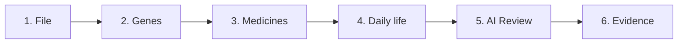
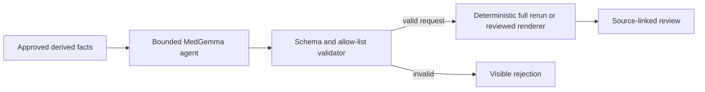

# Antidepressant PGx system

## The system in one minute

The system reads a genome result and shows how supported metabolism genes may affect exposure
to specific antidepressants. It matches each supported gene–medicine pair to the exact CPIC
guidance. After a medicine is selected, it shows that medicine's sourced food, timing and
warning facts against the person's routine.

A bounded MedGemma agent can then find missing information, connect several constraints,
request safe “what if” recalculations and prepare questions for the prescriber. It does not
make the clinical result. PharmCAT, CPIC rules and regulator labels do that.

The patient starts the process. The clinician makes the prescribing decision.

## The hard boundary

Genetics can sometimes explain why normal exposure may be harder to achieve. A person may
clear a medicine faster or slower than usual, and another medicine may change an enzyme's
functional activity.

For supported pairs, CPIC may say to use usual starting guidance, change a starting or
maintenance dose, titrate differently, monitor more closely or consider another medicine.
The product must show the captured action. It must not shorten it to “safe”, “unsafe”, “best”
or “correct dose”.

Genetics does **not** predict which antidepressant will improve a person's depression. The
system never claims that it does.

## The six-step validation app

1. **File** shows what was uploaded, how its format was detected and whether it can run.
2. **Genes** translates supported calls into plain English and shows coverage limits once.
3. **Medicines** groups exact CPIC actions without predicting benefit or ranking drugs.
4. **Daily life** matches one selected medicine's sourced protocol with stated routine data.
5. **AI Review** shows the model connection and only displays validated structured output.
6. **Evidence** exposes the inputs, rules, versions, citations, rejections and raw result.

These are validation views, not prescribing steps.

## One source of truth for each fact

| Output | Source of truth | Can AI create it? |
| --- | --- | --- |
| File type and build | Deterministic file checks | No |
| Variant and diplotype call | PharmCAT or validated specialist caller | No |
| Phenotype and activity score | PharmCAT/CPIC translation | No |
| Current-medicine adjustment | Versioned deterministic interaction rule | No |
| Drug-specific PGx action | Exact CPIC table row | No |
| Timing, food and labelled warning | Versioned regulator-approved label | No |
| Missing-field or counterfactual request | Bounded AI, validated against allowed types | Yes |
| Constraint and follow-up summary | Bounded AI over approved facts | Yes |
| Prescribing decision | Patient and clinician | Never automated |

Every clinical statement must keep:

- the input or derived fact ID;
- the exact rule that created it;
- the source and version;
- its limitation state; and
- whether AI changed its organisation or wording.

## How the AI is useful

The AI is not a chatbot with access to a genome. It is a constrained agent over a typed,
source-backed patient record.

### 1. Adaptive questions

The model may select the next useful question from an approved list. For example, a chosen
medicine may require a meal-pattern field that is still missing. The answer becomes a typed
input. The model cannot ask for arbitrary data or fill in an answer itself.

### 2. Constraint review

The model may connect already-approved facts across gene results, current medicines,
treatment history and daily routine. It can point out a missing field or conflict and explain
why it matters. It cannot change any underlying fact.

### 3. Typed counterfactual requests

The model may request an allowed scenario, such as recalculating the view with a different
recorded current-medicine list. The request is validated, then the deterministic system reruns
the **whole** calculation. The model never predicts the scenario result and cannot patch one
part of an old result.

### 4. Daily protocol arrangement

The model may organise regulator-label facts around the person's stated schedule, meals and
other supported routine fields. It cannot add generic wellness advice or turn a label fact
into an instruction.

### 5. Longitudinal synthesis

When follow-up data is available, the model may summarise recorded symptoms, side effects,
adherence and the clinician's plan across time. It may turn gaps into questions for the next
appointment. It cannot diagnose, judge urgency or alter the plan.

### 6. Plain-language explanation

The model may explain approved facts at the requested reading level. This is one function of
the agent, not its whole purpose.

## The AI contract

Only derived, structured facts are sent to the model. The raw genome and direct identifiers
are excluded.

The model must return a typed object containing only allowed request types, known medicines,
known fact IDs and known evidence IDs. It cannot introduce a clinical number, dose, guideline
action or source. A mechanical validator rejects unknown or malformed output. Rejection is
visible; the system does not silently replace it with plausible text.

The model's own wording is retained in the audit record, but the main AI Review screen does
not present it as medical truth. The screen renders reviewed fixed wording from the validated
action, fact IDs and typed rerun request. This prevents an allow-listed sentence with reversed
meaning from becoming patient-facing output.

The model cannot:

- read or translate a raw genome;
- call a variant, diplotype or phenotype;
- calculate phenoconversion, a dose or a PGx action;
- choose, rank, start, stop or switch a medicine;
- diagnose depression or triage risk;
- resolve conflict between sources; or
- invent a fact or citation.

Any crisis or urgent-care path must be a separately validated product control, not model
judgement.

## What exists now

| Part | Current state |
| --- | --- |
| Validation UI | Six focused views: File, Genes, Medicines, Daily life, AI Review and Evidence |
| Fictional examples | Run through a reduced six-variant parser |
| PharmCAT report import | Supported; report-only coverage remains explicit |
| Raw VCF or consumer upload | Deterministic inspection and prototype preview only |
| Real PharmCAT service | Pinned Docker script exists; governed upload backend does not |
| CPIC rules | Captured local SRI 2023 and TCA 2016 tables |
| Current-medicine adjustment | Deterministic CYP2D6 method where supported; unresolved interactions stay warnings |
| Daily-life matching | Deterministic, for fields backed by a selected medicine's cached label facts |
| Medicine labels | Cached US FDA excerpts; not yet Australian PI/CMI |
| Australian scope | Draft candidate list; not used in results |
| Plain-language AI adapter | Optional draft adapter exists; no service is enabled by default |
| Smart AI review | Privacy-minimised context, same-origin provider, typed contract, validator and validation UI are implemented; no live service or clinical release is enabled |
| Counterfactuals | Typed requests are validated; the production full-pipeline rerun executor is not wired yet |
| Follow-up journey | Engine concepts exist; production capture and longitudinal evaluation remain future work |

This is a system-validation prototype, not a clinical product.

For development, `VITE_MEDGEMMA_ENDPOINT` selects the governed same-origin review endpoint.
`VITE_MEDGEMMA_MODEL` may override the model name. If the endpoint is absent, the provider
returns `not_connected`; it does not simulate a review. Neither setting is an authentication
secret, and no model credential belongs in a `VITE_` variable.

## File handling

### PharmCAT Reporter JSON

The app can import a Reporter JSON and preserve reported software and data versions. A report
without PharmCAT's missing-position artefact is labelled `coverage unknown`. CYP2D6 remains
limited unless the report records an appropriate outside call that accounts for structural
and copy-number variation.

### GRCh38 VCF

A production backend must run pinned PharmCAT preprocessing and PharmCAT releases. It must
keep the input, normalised output, missing-position file and run manifest.

PharmCAT requires GRCh38 and explicit required positions. Missing data is not reference data.
The system must not turn `./.` or an absent position into `0/0`.

### Consumer genotype file

A tested adapter may recognise a supported four-column consumer format and convert observed
rows into a sparse, traceable intermediate file. It must not guess build, strand, phase or
missing alleles. Consumer arrays are usually incomplete for clinical PGx, especially CYP2D6.

### Unsupported input

The system stops and explains what is missing. AI may organise a fixed error into plain
language, but it may not repair or infer genetic data.

## Data used

### Needed for a PGx result

- genome data or a PharmCAT report;
- test type, genome build, coverage and quality metadata;
- current medicines and supplements; and
- exact tool and evidence versions.

### Needed after a medicine is chosen

- the chosen medicine and formulation;
- the clinician's dosing and review plan;
- only daily-routine fields that match a sourced drug rule; and
- symptoms, side effects and adherence at agreed follow-up points.

Depression questionnaires and lifestyle information do not change the genetic call. The UI
keeps each input beside the output it can affect.

## Australian evidence

The repository contains a candidate Australian antidepressant list. It defines useful scope,
but it cannot drive patient results yet because:

- ARTG identifiers and current registration status are missing;
- PBS items, formulations, restrictions and retrieval dates are missing;
- Australian PI/CMI evidence is not attached; and
- shortened summaries must be reconciled against the exact CPIC rows.

Production localisation needs a dated evidence release built from exact CPIC rules plus
current ARTG, PBS and Australian PI/CMI records.

## Privacy

- Inspect and hash the genome locally where possible.
- Send raw genetic data only to the governed bioinformatics service that needs it.
- Send no raw genome or direct identifier to AI.
- Prefer typed fields to free text.
- Record consent, purpose, access, retention and deletion.
- Keep fictional example data visually distinct from patient data.

## How to extend the system

Extend the evidence and typed contracts before extending model freedom:

1. Build the governed PharmCAT backend and immutable run manifest.
2. Add a validated structural-variant-aware CYP2D6 path.
3. Reconcile each Australian medicine with exact CPIC, ARTG, PBS and PI/CMI records.
4. Publish versioned evidence releases with automated source and conflict checks.
5. Add new medicines through data rows, tests and reviewed plain-language templates.
6. Add approved adaptive-question and counterfactual request types one at a time.
7. Validate each deterministic rerun against fixed expected results.
8. Add selected-medicine daily protocols only from current regulator sources.
9. Add longitudinal follow-up capture and clinician-plan records.
10. Evaluate MedGemma on missing data, contradictions, unsupported requests, prompt attacks and
    counterfactual consistency before clinical release.

The model does not learn a new drug by prompting. A new drug needs exact gene–drug rules,
label facts, Australian status, tests and reviewed wording.

## Release blockers

Do not use this system for care until it has:

- clinically validated genetic inputs and CYP2D6 handling;
- reconciled, versioned Australian evidence;
- clinical and human-factors validation;
- a representative AI safety and counterfactual evaluation set;
- security, privacy, consent and audit controls;
- a safe deterministic crisis and clinician-escalation pathway; and
- legal and regulatory review for the intended use.
