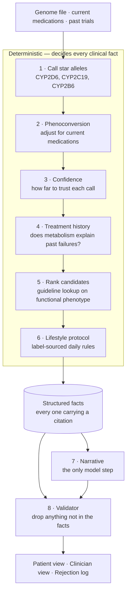

# How Meridian works

## What it is

Someone uploads their DNA file, lists what they currently take, and lists the antidepressants
they have already tried. They get back two versions of one report: a plain one for them, a
dense cited one for their prescriber.

The target user is not a rare case. Only about a third of people get better on their first
antidepressant. A meaningful slice of the rest were never on the wrong drug, they were on the
wrong amount of it: cleared too fast to work, or too slowly to tolerate. That is measurable,
and it is what this looks for.

## The rule everything is built around

> The AI never generates a dose, a drug name, or a clinical fact.
> Those come from guideline lookup tables. The AI explains what the tables already said.

A validator sits between the AI and the screen. It reads every sentence the AI wrote and
deletes any that contains a number, a drug name, or a citation that is not present in the
structured data the engine produced. Deleted sentences are logged, and the log is shown in
the product.

Everything else is plumbing around this.

---

# The journey

One page, four sections, progressive disclosure. Nothing leaves the browser.

## 1. Getting in

The opening line is `Your antidepressant may have failed at the dose, not the drug.` That
framing does real work. The person reading it has usually been told, implicitly, that they
are treatment resistant. The first thing the product says is that this might be arithmetic
rather than a fact about them.

Three steps, all visible at once, none of them gated:

**Your genome file.** A drop zone for a 23andMe export or a VCF. Underneath it, three
prepared cases with known results, because most people arriving have no VCF on their desktop
and the product should still be able to show them what it does. Each prepared case also
downloads as a real genome file, so the upload path can be exercised rather than described.

**What you take now.** Autocomplete chips. The hint text pushes for painkillers, heartburn
tablets and herbal supplements specifically, because those are the ones people leave out and
they are frequently the ones that matter.

**What you have already tried.** Drug plus outcome: did not help, side effects, it helped.
This is the input no genotype tool asks for, and it is what lets the report explain the past
instead of only guessing at the future.

Then one button, and a line confirming nothing is uploaded or stored.

## 2. The wait

Not a spinner. The real pipeline steps appear one at a time with their real timings, and each
one is tagged as deterministic, model, or validator.

The analysis itself takes about 120ms. The pause exists so the person can see what was done on
their behalf, and see that exactly one of the eight steps involved a language model.

## 3. The report

Scrolls in this order, deliberately.

### Metaboliser profile

The hero moment. One card per gene, with two rows:

```
 ┌── CYP2C19 ──────────────┐   ┌── CYP2D6 ───────────────┐
 │ From your genes:  Inter │   │ From your genes: Normal │
 │ In practice:      Inter │   │ In practice:     POOR ⚠ │
 │ ● high confidence       │   │ ↳ fluoxetine, a strong  │
 └─────────────────────────┘   │   CYP2D6 blocker        │
                                │ ◌ low confidence        │
                                └─────────────────────────┘
```

When those two rows disagree, the second value drops in and shifts to red a beat after the
card lands. That gap is the entire thesis in one glance: the genes are ordinary, and a drug
already being taken changed the picture. A genetic test on its own cannot see this, because it
does not know what else is in the cupboard.

Where the engine cannot resolve an interaction, the card says so in a greyed panel rather than
producing a number. Honesty is a visible design element, not a footnote.

### Reviewed, not used

A deliberately greyed panel showing SLC6A4 and HTR2A, the two "serotonin genes" commercial
panels love to report, with CPIC's conclusion that the evidence does not support using them.
It answers "what about my serotonin gene result" before the question is asked, and it is a
differentiator rather than a gap.

### The shortlist

Traffic light rows, sorted, one line each:

```
 ✅ sertraline    usual starting dose, slower titration   not CYP2D6-dependent
 ⚠  vortioxetine  reduce starting and maintenance dose    CYP2D6 Poor (functional)
 ⚠  escitalopram  usual starting dose, slower titration   tried before
```

Any row opens to the full guideline wording quoted verbatim, why the drug sidesteps this
person's specific problem, interaction flags, the washout timing if the switch is affected by
what they currently take, and the score arithmetic.

Rows carry context the person actually needs: `tried before` sits next to anything already
attempted, so a drug that failed can never quietly show a green tick.

### Two tabs

**For you** is the default, and it runs in narrative order:

- *The short version.* What is going on, in three sentences.
- *Looking back.* An annotated timeline of past trials. Each one says whether the metabolism
  explains what happened, and where it does not, it says that plainly instead of inventing a
  reason.
- *Looking forward.* What a prescriber might consider next, framed as information to bring to
  an appointment rather than an instruction.
- *Your daily protocol.* Timing, food, what to avoid, what to watch for, each line sourced to
  a label section.
- *One thing this report cannot tell you.* A closing card stating that genetics cannot predict
  which antidepressant will lift someone's mood.

**For your prescriber** is dense and cited: the phenotype table, the phenoconversion
rationale, the confidence caveats, and a side by side comparison showing what a genotype-only
report would have said versus what this says once medication context is included. That
comparison is the clearest answer to "PharmCAT already does this".

### How to trust this

Counts of claims checked and claims rejected, then the rejection log itself: the struck-through
sentences the AI produced, the exact token that failed, and why. Below that, what the validator
checked against, and the pipeline trace.

This is a product surface, not an appendix. "Our AI cannot hallucinate a dose" is a claim, and
a safety claim should be inspectable.

### Footer

`Decision support only. Not a diagnosis.` Pinned, never scrolls away.

---

# The pipeline



Steps 1 to 6 are pure code. They have already decided every clinical fact before the model is
called, and the model receives those facts as its only material.

### What each step does

**1. Call star alleles.** Genome to diplotype to phenotype for the three genes CPIC makes
actionable for antidepressants. Fast, normal, or slow processor for each.

**2. Phenoconversion.** Some drugs block those same enzymes. Fluoxetine blocks CYP2D6
completely, so a person with entirely normal CYP2D6 genes behaves as though they have none
while taking it. The adjustment is applied for CYP2D6 only, because that is the only gene with
a guideline-operationalised method. For CYP2C19 and CYP2B6 the interaction is flagged loudly
and left unresolved, because CPIC states no consensus method exists and inventing one would be
the exact failure this product exists to prevent.

**3. Confidence.** CYP2C19 reads cleanly from a consumer DNA kit. CYP2D6 does not, because
what matters most is how many copies of the gene there are, and SNP arrays cannot see copy
number at all. That becomes a per-gene trust score, and the ranking step consumes it: when a
gene call is shaky, drugs that do not depend on that gene are actively preferred.

**4. Treatment history.** For each past trial, one question. Does this person's metabolism
account for what happened? The answer is allowed to be no.

**5. Rank candidates.** Query the guideline table for every candidate using the *functional*
phenotype rather than the genetic one, because tolerability in the first weeks decides whether
someone stays on a drug, and in those weeks the interacting medication is still on board. Score
on guideline action, call confidence, interactions, and treatment history.

**6. Lifestyle protocol.** Fuse label-sourced timing, food and interaction rules with the
person's other medications. Critical items are pinned and cannot be collapsed.

**7. Narrative.** Compose the patient and clinician prose over facts that are already fixed.
The patient and clinician versions are written separately rather than one being a rewrite of
the other, so the patient-facing page never says "this patient".

**8. Validator.** Four checks, all mechanical:

1. Every number in the prose must already appear in the structured input.
2. Every drug name must already appear in the structured input.
3. Every citation must be one the engine actually emitted.
4. A sentence making a clinical assertion with no citation is dropped.

The number check is unit aware. A guideline saying "a 50% reduction" does not license the model
to write "50 mg". A value carrying a clinical unit must match a value carrying the same unit in
the source.

---

# Code layout

Three layers. They only communicate through `src/engine/types.ts`, which is the contract.

```
src/
  data/          the facts
    sources/       captured CPIC and openFDA source data, as retrieved
    cpic.ts        guideline lookup
    interactions.ts FDA inhibitor and inducer classifications
    lifestyle-rules.ts curated protocol rules
    citations.ts   every source; an unknown id throws rather than rendering
    pharmacology.ts washout windows, autoinhibition, equivalent drugs

  engine/        the logic, one file per pipeline step
    types.ts       the contract
    pharmcat/      star allele calling, adapter interface, fixtures
    phenoconversion.ts
    confidence.ts
    history.ts
    ranking.ts
    lifestyle.ts
    orchestrator.ts the only model-touched step
    validator.ts   the claim boundary
    pipeline.ts    wires it together, emits the trace the UI renders

  ui/            display only, never calculates anything clinical
```

If a clinical fact is wrong, it is wrong in `data/` and nowhere else. If the reasoning is
wrong, it is in one file in `engine/`. The UI cannot be the cause of a clinical error, because
it does no clinical computation.

## The star-allele adapter

`PharmCATAdapter` has one method and three implementations behind it:

- **Fixture** — known diplotypes. The demo path, so a demonstration cannot fail on live
  variant calling.
- **Tag-SNP** — a real but deliberately reduced caller for uploaded files. Reads the handful of
  markers consumer arrays actually carry and reports everything it could not see. It is not
  PharmCAT and does not pretend to be, and the confidence layer marks it down accordingly.
- **Docker** — the real PharmCAT, via `scripts/run-pharmcat.sh`. The script documents the exact
  JSON shape to parse and the traps, including that `sourceDiplotypes` and
  `recommendationDiplotypes` are different arrays and joining on the wrong one silently
  mismatches recommendations.

Swapping to real PharmCAT is a parsing change, not a redesign.

---

# Design principles

**Red is reserved.** It appears only for critical protocol items and avoid verdicts. In a
product read by someone who is depressed and has already had two medications fail, a red-heavy
interface reads as a verdict on them.

**Absence is information.** "No food restrictions for this drug" is a real answer and gets
rendered as one, rather than the row being omitted.

**Critical items cannot be collapsed.** The rules that are genuinely dangerous to miss are also
the ones a tidy interface would tuck away first, so they are pinned open.

**Progressive disclosure everywhere else.** One line by default. The full guideline wording,
verbatim, on click.

**Nothing reads as a verdict on the person.** A drug that did not work is a fact about
pharmacokinetics.

---

# Invariants

Break any of these and the architecture stops meaning anything.

1. **Clinical facts live in `data/` and always carry a citation id.** No source, no render. This
   is enforced in code: unknown citation ids throw, and lifestyle rules that end up uncited are
   dropped before they reach the screen.

2. **The model explains, it never decides.** If a prompt is being written that asks for a dose,
   stop. Everything the model receives is already fixed.

3. **All model output passes the validator.** Including deterministic template output, which
   always passes. A path that skipped the check would make the whole thing decorative.

4. **Both phenotypes travel together.** Genetic and functional are always carried and always
   shown as a pair. One without the other is misleading in both directions.

5. **No efficacy claims.** Genetics answers what dose, which drug is enzyme-safe, what will
   cause harm, and why past trials failed. It does not answer which antidepressant will lift
   the depression, and the product says so in both views.
