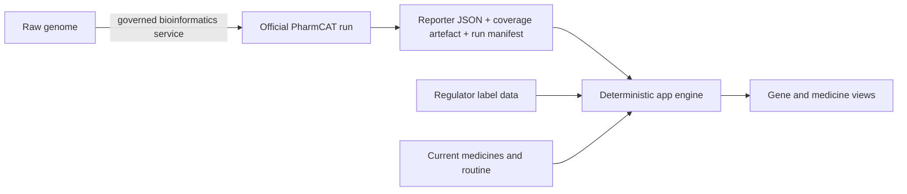
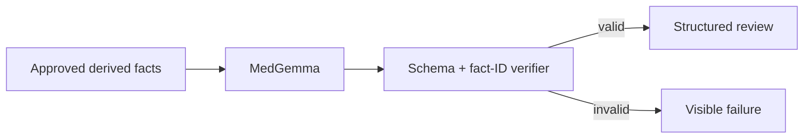

# Antidepressant PGx system

## What it does

The system turns a recognised PharmCAT Reporter JSON into a short journey:

```text
File → Genes → Medicines → Daily life → AI review → Evidence
```

- **Genes** explains how the reported enzymes may process supported medicines.
- **Medicines** shows exact guideline wording about exposure and dosing.
- **Daily life** compares routine answers with draft drug-specific label summaries.
- **AI review** connects those run-derived facts, finds gaps or conflicts, and prepares questions.
- **Evidence** shows exactly where every result came from.

The patient can start the process. The clinician makes the prescribing decision.

## What it does not do

Genetics can affect medicine exposure. It does not reliably tell us which antidepressant will
improve a person's depression. The system therefore never:

- predicts treatment success;
- ranks medicines by likely antidepressant benefit;
- diagnoses depression;
- starts, stops or changes a medicine;
- calls a medicine safe; or
- hides missing or rejected evidence.

Guideline text may say to consider another medicine or review a dose. That text is something
to discuss with a prescriber, not an instruction to the patient.

## The clinical data path



### 1. Input

The working validation input is PharmCAT Reporter JSON.

- The built-in example is downloaded from PharmCAT's official examples site at run time.
- A user can upload their own Reporter JSON.
- An upload is checked for the expected Reporter structure. That does not authenticate its
  origin or prove that it came from a governed PharmCAT run.
- A raw VCF or consumer DNA file is only inspected in the browser. It cannot produce a
  clinical result until the real PharmCAT service succeeds.
- If the official example, upload or service fails, the result fails. Nothing forces success.

### 2. Gene results

The app imports the gene call, diplotype, phenotype, activity score, source and software/data
versions reported by PharmCAT. It translates the phenotype into plain English but keeps the
scientific value in Evidence.

Reporter JSON does not contain the separate missing-position VCF, so an uploaded report by
itself is labelled **coverage unknown**. CYP2D6 copy number and structural variation also stay
unresolved unless a validated outside caller and its run evidence are supplied.

### 3. Medicine guidance

The app imports PharmCAT's exact CPIC Guideline Annotation. It does not recreate a dosing
recommendation from a few variants or from model prose. All attached gene results are kept,
so combined-gene guidance such as CYP2C19 + CYP2B6 is not reduced to one gene.

The app may group exact guidance under a simple heading such as **Review the dose**. That
heading is navigation only; the full imported recommendation remains the clinical fact.

### 4. Current medicines

A versioned deterministic rule can identify a current medicine that may change enzyme
activity. A CYP2D6 inhibition calculation is shown only as a named research-convention
estimate, not as a new patient phenotype or dosing authority. This stays separate from the
genotype-only PharmCAT result. If the estimate and imported guidance need reconciliation,
the app raises a prescriber question; it does not rewrite the PharmCAT recommendation.

### 5. Daily life

After one medicine is selected, the app asks only for routine information that its current
matching rules can compare. Current data is a draft cache of selected US label summaries. It
is clearly marked as draft US data, is not exact source text and is not presented as
Australian product information.

## How AI is involved

MedGemma is a constrained reviewer, not the clinical calculator and not a general chatbot.



Useful model work includes:

- connecting a gene result, current medicine and routine constraint;
- identifying a missing fact that could change the discussion;
- exposing contradictions or weak evidence;
- preparing source-linked questions for the prescriber; and
- later, summarising recorded treatment experience over time.

The model receives derived facts only. It never receives the raw genome. It cannot create a
gene call, dose, guideline action, label fact or citation. It returns a fixed JSON shape with
an action and known fact/source IDs, but no medical prose. Deterministic code displays the
linked facts. Unknown fields, invented IDs, malformed output, timeouts and provider errors
are rejected. There is no fallback answer.

For this validation build, AI review is enabled only for the live official example. Uploaded
reports are blocked because browser-supplied facts are not yet tied to an authenticated,
server-authoritative run record. Before public use, the API also needs user authentication,
per-run authorisation and rate limits.

The implemented gateway is:

```text
Browser → Vercel /api/clinical-review → Vercel OIDC → Google WIF → private Vertex MedGemma
```

The endpoint is operator-controlled. The client cannot select an arbitrary upstream model or
URL. No Google service-account key or model credential is stored in the browser.

## Data used

| Data | Why it is used | Sent to AI? |
| --- | --- | --- |
| Raw genome | Bioinformatics calling only | No |
| PharmCAT gene results | Explain metabolism | Derived labels only |
| Exact PharmCAT/CPIC annotations | Medicine guidance | Approved fact text/IDs only |
| Current medicines | Deterministic interaction context | Approved derived effects only |
| Selected medicine | Choose relevant label facts | Yes |
| Relevant routine answers | Match label facts to daily life | Yes, typed fields only |
| Treatment history and follow-up | Future journey summary | Only explicitly selected structured fields |
| Direct identifiers | Not required | No |

Depression questionnaires and lifestyle answers never change the genetic call. Each input is
kept beside the output it can affect.

## What is implemented now

| Part | Status |
| --- | --- |
| Six-view validation app | Implemented |
| Official PharmCAT example | Fetched live; no substitute on failure |
| Reporter JSON import | Implemented |
| Raw VCF/consumer clinical calling | Blocked until real PharmCAT backend succeeds |
| Exact PharmCAT CPIC annotations | Implemented, including combined-gene results |
| Current-medicine enzyme context | Deterministic supported rules; limitations visible |
| Daily-life matching | Implemented with draft cached US label summaries; source verification pending |
| MedGemma gateway | Implemented and fail-closed |
| Live MedGemma endpoint | Requires operator deployment and environment configuration |
| Raw-genome PharmCAT cloud service | Designed, not implemented |
| Australian clinical evidence release | Not yet reconciled |
| Long-term depression journey | Planned, not yet a validated clinical feature |

The official example shows that the current Reporter parser and result journey work against
PharmCAT's published example. It does not validate a laboratory assay, CYP2D6 caller, model
endpoint or future cloud worker. Those must be tested separately.

## How to extend it safely

1. **Raw genome support:** build the private Cloud Storage upload and asynchronous Cloud Run
   PharmCAT worker. Pin the official container by a verified full digest and store the input
   hash, command, versions, output hashes, coverage artefact and terminal status in one run
   manifest.
2. **CYP2D6:** integrate and validate a structural/copy-number-aware outside caller. Never
   infer it from a sparse consumer array.
3. **Australian evidence:** reconcile every supported medicine against dated CPIC, ARTG, PBS
   and Australian PI/CMI records. Publish it as a reviewed versioned release.
4. **More medicines:** add evidence rows, exact citations, parser/engine tests and reviewed
   plain-English wording before exposing a medicine.
5. **Smarter model actions:** add one typed request at a time. A “what if” request must rerun
   the deterministic engine; the model cannot edit an old result.
6. **Treatment journey:** add clinician plan, dose, adherence, side-effect and symptom records
   with clear dates and provenance, then evaluate the summaries against clinician review.

A prompt alone cannot add a medicine, fix missing genetics or make a model clinically valid.

## Deployment

Use Vercel for the app and small AI gateway. Use Google Cloud for MedGemma and the future
containerised PharmCAT workload. Raw genome files must upload directly to private Cloud
Storage rather than pass through Vercel.

The exact setup, identity boundary and environment variables are in
[DEPLOYMENT.md](DEPLOYMENT.md).

## Release boundary

This remains a validation build. Real patient use requires validated genetic inputs,
structural CYP2D6 handling, reconciled Australian evidence, clinical and human-factors
testing, privacy/security controls, an evaluated crisis pathway, and legal/regulatory review.
